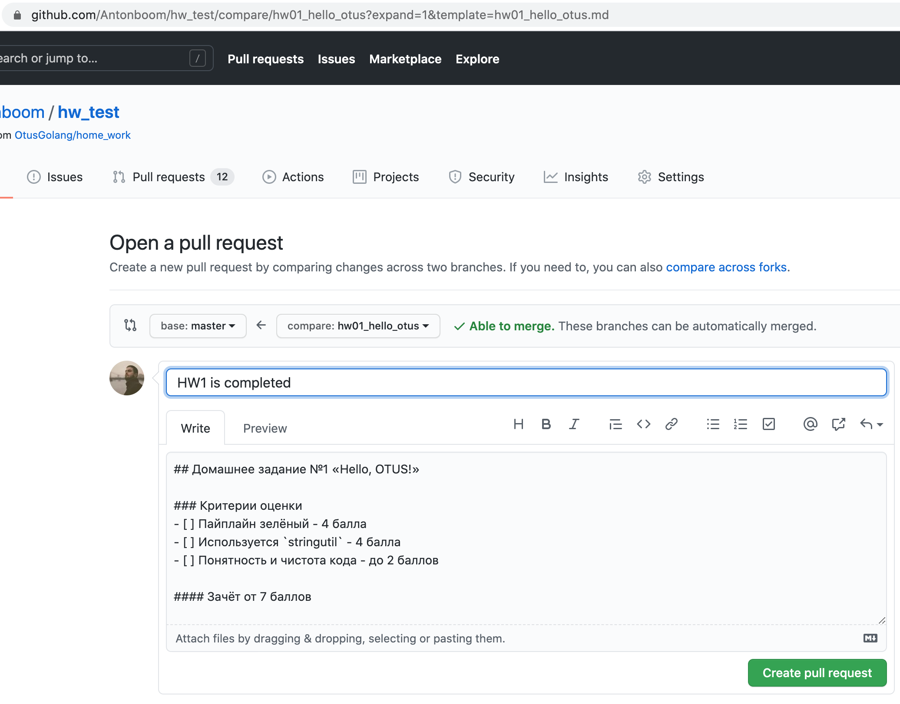
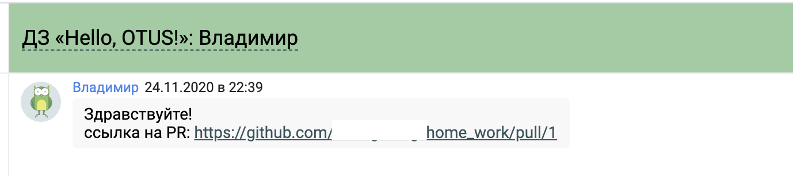

## Процесс сдачи домашнего задания
### Настройка репозитория и создание Pull Request
Для сдачи ДЗ необходимо выполнить следующие действия (по порядку):
* Нажмите на зелёную кнопку **«Use this template»** на странице данного репозитория.
* Подождите пока для сгенерируется новый репозиторий на основе текущего.
* Подключите к новому репозиторию Travis CI:
1) https://travis-ci.com/
2) Sign in with GitHub
3) Activate all repositories using GitHub Apps
4) Only selected repositories -> Выбираете ваш новый
5) Approve & Install
* Склонируйте себе ваш репозиторий (например, я назвал свой `hw-test`):
```bash
$ git clone https://github.com/Antonboom/hw-test.git
```
* Создайте ветку **с именем таким же, как директория, где лежит ДЗ**. Это важно!
```bash
$ cd hw-test
$ git checkout -b hw01_hello_now
```
* Реализуйте код домашнего задания.
* Проверьте, что следующие команды завершаются успешно:
```bash
$ golangci-lint run .
$ go test -v -count=1 -race -gcflags=-l -timeout=30s .
$ ./test.sh # При наличии
```
Это те команды, которые запускаются в CI (см. [.travis.yml](./.travis.yml)).
Дополнительно CI проверяет работоспособность `go get` для текущего модуля
(в нашем случае `hw01_hello_now`).
* Зафиксируйте изменения и запушьте ветку в репозиторий:
```bash
$ git commit -am "HW1 is completed"
$ git push origin hw01_hello_now
...
remote: Create a pull request for 'hw01_hello_now' on GitHub by visiting:
remote:      https://github.com/Antonboom/hw-test/pull/new/hw01_hello_now
```
* Как видно выше, GitHub предложит вам URL для создания пулл реквеста, пройдите по нему.


* Допишите в конец URL параметр вида `&template=<имя_ветки>.md` и нажмите Enter -
PR обновится в соответствии с одним из [шаблонов](./.github/PULL_REQUEST_TEMPLATE).



* Нажмите кнопку «Create pull request».

* Зайдите на страницу настроек доступа (Settings -> Manage access):
    * нажмите "Invite a collaborator" и пригласите наставников:
        - Алексей Бакин **kulti** ;
        - Антон Телышев **Antonboom** ;
        - Артём Картасов **agneum** ;
        - Иван Иванов **orensimple** ;
        - Олег Венгер **farir1408** ;
        - Юрий Юрочко **forward32** .

Это необходимо для того, чтобы наше ревью в вашем PR имело "вес", а также,
чтобы мы могли выставлять галочки в критериях оценки :)

* Зайдите на страницу настроек веток репозитория (Settings -> Branches):
    * выбрать Default branch - master;
    * добавить новое правило (Branch protection rules -> Add rule):
        * Branch name pattern - `master` (именно так);
        * выставить галочку "Require pull request reviews before merging";
            * выставить галочку "Dismiss stale pull request approvals when new commits are pushed";
            * выставить галочку "Require review from Code Owners";
        * выставить галочку "Require status checks to pass before merging";
        * выставить галочку "Require branches to be up to date before merging";
        * выставить галочку "Travis CI - Pull Request";
        * выставить галочку "Include administrators";
        * нажать кнопку «Create».


* Скиньте ссылку на PR в чат с преподавателем **в личном кабинете OTUS** (не в Slack).



* Пройдите ревью и **после одобрения пулл реквеста** вмержите PR в master.


* Complete!

Если вам заапрувили реквест, но вы хотите поднять баллы (например, вам поставили 8/10 при зачёте от 7),
то просто продолжайте пушить в этот же PR, не закрывая его.

Чтобы преподаватель повторно провёл ревью, сообщите ему об этом в чат с преподавателем в Otus
или через комментарий в PR с аннотацией преподавателя, например,
```text
@Antonboom
Все замечания подправил, билд зеленый, можно проверять :)
```

#### Убедительная просьба не мержить реквесты без апрува от проверяющего.

Если вы не хотите, чтобы CI запускался на каждый push в ветку, а работал
только при пулл реквесте, то снимите галочку "Build pushed branches"
на странице настроек репозитория в Travis CI
(https://travis-ci.com/your-user/your-repo/settings).

Также, если вы хотите, чтобы сборка запускалась только для последнего актуального коммита,
то настройте "Auto Cancellation".


### Обновление ветки master своего репозитория
Базовый репозиторий обновляется (добавляются ДЗ, меняется документация, тесты, фиксятся ошибки и пр.).

Поэтому иногда нужно "руками" притянуть в свой репозиторий новые / обновленные файлы.

Это можно сделать двумя способами:
1) Включить обновления в текущий PR по домашней работе. Так после слияния они попадут в ваш master.
2) Обновить самостоятельно свой master и из него уже обновить ветку с ДЗ, например,
мы обновили `.travis.yml`
```
$ git checkout master
$ cp ~/Downloads/.travis.yml .travis.yml
$ git commit -am "Update travis config"
$ git push origin master
```
Для этого необходимо временно разрешить администраторам пушить в репозиторий в обход всех проверок,
т.е. снять галочку "Include administrators" в правиле защиты ветки master (Settings -> Branches).
**После обновления репозитория галочку стоит вернуть на место :)**

Подтягиваем в ветку обновленный master:
```
$ git checkout hw01_hello_now
$ git pull origin master
$ git push origin hw01_hello_now
```

### Списывание
Домашние задания нужны **вам**, а не нам. За их невыполнение родителей в школу не вызовут.
Мимо нас проходят сотни решений и понимание того, прислал человек свой код или чужой,
происходит моментально. Это не влечёт за собой ничего, кроме как ухудшения отношения к нему,
как к потенциальному кандидату и будущему коллеге.

### Обратная связь
Сообщайте о найденных опечатках, ошибках, недочётах и пр.

Пожалуйста, не спешите писать о "неправильных тестах", если ваша программа
не проходит их. Сначала ещё раз внимательно прочитайте условие ДЗ
и проверьте написанный код. Спасибо! 
